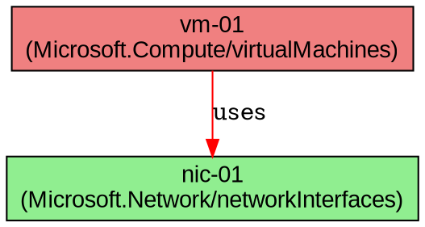

# Dependency Resolver Guide

## Overview

The **Dependency Resolver** is a core component of the Azure Infrastructure Toolkit that builds and analyzes Directed Acyclic Graphs (DAG) of resource dependencies. This enables intelligent operations like:

- **Smart deployment ordering** - Deploy resources in the correct order based on dependencies
- **Impact analysis** - Understand what resources will be affected by changes
- **Deletion planning** - Safely delete resources by understanding dependents
- **Topology visualization** - Generate GraphViz diagrams of infrastructure

## Architecture

The dependency resolver works by:

1. **Detecting dependencies** from Azure resource JSON metadata
2. **Building relationship graphs** with typed edges (required, optional, reference)
3. **Storing relationships** in the state database or JSONL files
4. **Querying graphs** for paths, trees, and cycles

## Dependency Types

### Dependency Strength

- **`required`** - Resource cannot exist without this dependency (e.g., VM → NIC)
- **`optional`** - Resource can exist without this dependency (e.g., VM → Availability Set)
- **`reference`** - Resource references another but doesn't depend on it (e.g., HostPool → Workspace)

### Relationship Semantics

- **`uses`** - Resource uses another resource (e.g., VM uses NIC)
- **`contains`** - Resource contains another resource (e.g., VNet contains Subnet)
- **`references`** - Resource references another resource (e.g., Application Group references Host Pool)
- **`peers-with`** - Resource peers with another resource (e.g., VNet peering)

## Supported Resource Types

### Compute
- **Virtual Machines** - Detects dependencies on NICs, disks, availability sets, images, storage accounts, extensions

### Networking
- **Network Interfaces** - Detects dependencies on subnets, VNets, NSGs, public IPs, load balancers, ASGs
- **Virtual Networks** - Detects dependencies on subnets, NSGs, route tables, peerings, DDoS protection
- **Public IP Addresses** - Tracked as dependencies by NICs

### Storage
- **Storage Accounts** - Detects dependencies on private endpoints, VNet integration, Key Vault encryption

### Azure Virtual Desktop (AVD)
- **Host Pools** - Tracks relationships with session hosts
- **Application Groups** - Detects dependencies on host pools
- **Workspaces** - Detects dependencies on application groups

### Generic Resources
- **Auto-detection** - For unknown types, scans for resource ID patterns in properties

## Usage Examples

### Detecting VM Dependencies

```bash
#!/bin/bash
source core/dependency-resolver.sh

# Get VM JSON from Azure
vm_json=$(az vm show -g my-rg -n my-vm)

# Detect all dependencies
dep_count=$(detect_vm_dependencies "$vm_json")

echo "Found $dep_count dependencies for my-vm"
```

### Building Complete Dependency Graph

```bash
#!/bin/bash
source core/dependency-resolver.sh

# Build graph from all discovered resources
build_dependency_graph

# Output: discovered/dependency-graph.json
# Contains: nodes (resources) and edges (dependencies)
```

### Exporting to GraphViz

```bash
#!/bin/bash
source core/dependency-resolver.sh

# Export to DOT format
export_dependency_graph_dot

# Render with GraphViz
dot -Tpng discovered/dependency-graph.dot -o infrastructure.png
open infrastructure.png
```

### Validating Dependencies

```bash
#!/bin/bash
source core/dependency-resolver.sh

# Validate all dependencies for a resource exist in Azure
resource_id="/subscriptions/.../virtualMachines/my-vm"

if validate_dependencies "$resource_id"; then
    echo "All dependencies satisfied"
else
    echo "Missing dependencies found!"
fi
```

### Detecting Circular Dependencies

```bash
#!/bin/bash
source core/dependency-resolver.sh

# Check for circular dependency cycles
if detect_circular_dependencies; then
    echo "No cycles detected - safe to deploy"
else
    echo "WARNING: Circular dependencies found!"
fi
```

### Getting Dependency Tree

```bash
#!/bin/bash
source core/dependency-resolver.sh

# Get full dependency tree for a resource (requires state.db)
resource_id="/subscriptions/.../virtualMachines/my-vm"
tree_json=$(get_dependency_tree "$resource_id" 5)

echo "$tree_json" | jq '.'
```

### Finding Dependency Path

```bash
#!/bin/bash
source core/dependency-resolver.sh

# Find shortest path between two resources
from_id="/subscriptions/.../virtualMachines/my-vm"
to_id="/subscriptions/.../virtualNetworks/my-vnet"

path=$(get_dependency_path "$from_id" "$to_id")
echo "Path: $path"
```

### Getting Root Resources

```bash
#!/bin/bash
source core/dependency-resolver.sh

# Get resources with no dependencies (entry points)
roots=$(get_root_resources)

echo "Infrastructure entry points:"
echo "$roots" | jq -r '.[] | .name'
```

## Integration with State Manager

When `core/state-manager.sh` is available and `STATE_DB` is set, the dependency resolver will:

1. **Store dependencies** in the `dependencies` table
2. **Query relationships** using SQL recursive CTEs
3. **Track validation** timestamps for dependency checks
4. **Enable advanced queries** like transitive dependency trees

### Database Schema

```sql
CREATE TABLE dependencies (
    id INTEGER PRIMARY KEY AUTOINCREMENT,
    resource_id TEXT NOT NULL,
    depends_on_resource_id TEXT NOT NULL,
    dependency_type TEXT NOT NULL,        -- 'required', 'optional', 'reference'
    relationship TEXT,                    -- 'uses', 'contains', 'references'
    discovered_at INTEGER NOT NULL,
    validated_at INTEGER,
    FOREIGN KEY (resource_id) REFERENCES resources(resource_id),
    FOREIGN KEY (depends_on_resource_id) REFERENCES resources(resource_id)
);
```

## Output Formats

### JSONL Dependencies File

When state database is not available, dependencies are stored in `discovered/dependencies.jsonl`:

```json
{
  "from": "/subscriptions/.../virtualMachines/vm-01",
  "to": "/subscriptions/.../networkInterfaces/nic-01",
  "dependency_type": "required",
  "relationship": "uses",
  "discovered_at": 1733500000
}
```

### JSON Graph Structure

```json
{
  "metadata": {
    "generated_at": "2025-12-06T16:00:00Z",
    "total_resources": 50,
    "total_dependencies": 120
  },
  "nodes": [
    {
      "id": "/subscriptions/.../virtualMachines/vm-01",
      "name": "vm-01",
      "type": "Microsoft.Compute/virtualMachines"
    }
  ],
  "edges": [
    {
      "from": "/subscriptions/.../virtualMachines/vm-01",
      "to": "/subscriptions/.../networkInterfaces/nic-01",
      "type": "required",
      "relationship": "uses"
    }
  ]
}
```

### GraphViz DOT Format



## Advanced Use Cases

### Pre-Deployment Validation

```bash
#!/bin/bash
# Validate all dependencies before starting deployment


source core/dependency-resolver.sh

validate_all_dependencies() {
    local failed=0

    # Get all resources
    for resource_id in $(get_all_resource_ids); do
        if ! validate_dependencies "$resource_id"; then
            echo "ERROR: Missing dependencies for $resource_id"
            ((failed++))
        fi
    done

    return $failed
}

if validate_all_dependencies; then
    echo "Pre-flight check passed - ready to deploy"
    ./deploy.sh
else
    echo "Pre-flight check failed - fix dependencies first"
    exit 1
fi
```

### Deletion Order Planning

```bash
#!/bin/bash
# Plan safe deletion order (reverse dependency order)

source core/dependency-resolver.sh

plan_deletion() {
    local resource_id="$1"

    # Get all dependents (things that depend on this)
    dependents=$(get_dependents "$resource_id")

    if [[ -n "$dependents" ]]; then
        echo "WARNING: The following resources depend on this:"
        echo "$dependents" | jq -r '.[] | "  - \(.name) (\(.resource_type))"'
        echo ""
        echo "Delete these resources first, or use --force to break dependencies"
        return 1
    fi

    return 0
}

# Example: Check if safe to delete a VNet
if plan_deletion "/subscriptions/.../virtualNetworks/my-vnet"; then
    echo "Safe to delete VNet"
else
    echo "Cannot safely delete VNet"
fi
```

### Change Impact Analysis

```bash
#!/bin/bash
# Analyze what will be affected by changes to a resource

source core/dependency-resolver.sh

analyze_impact() {
    local resource_id="$1"

    echo "Impact Analysis for: $(extract_resource_name "$resource_id")"
    echo "========================================"

    # Direct dependencies
    echo "This resource depends on:"
    get_dependencies "$resource_id" | jq -r '.[] | "  - \(.name) (\(.dependency_type))"'

    echo ""

    # Dependents (reverse dependencies)
    echo "These resources depend on this:"
    get_dependents "$resource_id" | jq -r '.[] | "  - \(.name) (\(.dependency_type))"'

    echo ""

    # Full transitive tree
    echo "Full dependency tree (depth 3):"
    get_dependency_tree "$resource_id" 3 | jq -r '.[] | "  \(.depth)) \(.depends_on_name) (\(.dependency_type))"'
}

# Example: Analyze impact of changing a subnet
analyze_impact "/subscriptions/.../subnets/default"
```

## Best Practices

### 1. Run Discovery First

Always run full discovery before building dependency graphs:

```bash
./core/engine.sh discover
./core/engine.sh build-dependencies
```

### 2. Validate Periodically

Dependencies can become stale if resources change. Revalidate regularly:

```bash
# Validate all dependencies
for resource_id in $(get_all_resource_ids); do
    validate_dependencies "$resource_id"
done
```

### 3. Check for Cycles

Before deployment, always check for circular dependencies:

```bash
if ! detect_circular_dependencies; then
    echo "Fix circular dependencies before deploying"
    exit 1
fi
```

### 4. Use Relationship Types

When adding custom dependencies, choose the correct type and relationship:

```bash
# Required dependency - VM needs NIC
add_dependency "$vm_id" "$nic_id" "required" "uses"

# Optional dependency - VM can have availability set
add_dependency "$vm_id" "$avset_id" "optional" "references"

# Reference - Workspace references application groups
add_dependency "$workspace_id" "$appgroup_id" "reference" "references"
```

### 5. Visualize Complex Environments

For large environments, generate visual dependency graphs:

```bash
# Generate graph
export_dependency_graph_dot

# Render high-quality PNG
dot -Tpng -Gdpi=300 discovered/dependency-graph.dot -o infrastructure-hq.png

# Or generate interactive SVG
dot -Tsvg discovered/dependency-graph.dot -o infrastructure.svg
```

## Troubleshooting

### Dependencies Not Detected

**Problem:** Dependencies aren't being detected for a resource type.

**Solution:** Check if the resource type has a detector function. Add one in `dependency-resolver.sh`:

```bash
detect_myresource_dependencies() {
    local resource_json="$1"
    local resource_id="${2:-$(echo "$resource_json" | jq -r '.id')}"

    # Extract dependency IDs from JSON
    local dep_id=$(echo "$resource_json" | jq -r '.properties.dependencyId')

    # Add dependency
    add_dependency "$resource_id" "$dep_id" "required" "uses"

    echo "1"  # Return count
}
```

### Circular Dependencies Detected

**Problem:** Deployment fails due to circular dependencies.

**Solution:** Identify the cycle and break it:

```bash
# Find the cycle
detect_circular_dependencies

# Check the specific resources involved
# Usually this indicates a design issue - refactor to remove the cycle
```

### Missing Dependencies File

**Problem:** `discovered/dependencies.jsonl` doesn't exist.

**Solution:** Run dependency detection:

```bash
# Ensure discovery has run
./core/engine.sh discover

# Build dependencies
build_dependency_graph
```

## Performance Considerations

### Caching

Dependency resolution can be slow for large environments. Use caching:

```bash
# Cache dependency graph
if [[ ! -f discovered/dependency-graph.json ]] || [[ $(find discovered/dependency-graph.json -mmin +60) ]]; then
    echo "Rebuilding dependency graph (cache expired)..."
    build_dependency_graph
else
    echo "Using cached dependency graph"
fi
```

### Parallel Detection

For large environments, detect dependencies in parallel:

```bash
# Get all resources
resources=$(az resource list)

# Detect in parallel
echo "$resources" | jq -c '.[]' | parallel -j 8 'detect_resource_dependencies "{}"'
```

## API Reference

See the function documentation in `core/dependency-resolver.sh` for detailed API reference.

### Core Functions

| Function | Purpose |
|----------|---------|
| `detect_vm_dependencies` | Detect VM dependencies |
| `detect_nic_dependencies` | Detect NIC dependencies |
| `detect_vnet_dependencies` | Detect VNet dependencies |
| `detect_storage_dependencies` | Detect Storage Account dependencies |
| `detect_resource_dependencies` | Generic dependency detection |
| `build_dependency_graph` | Build complete graph |
| `export_dependency_graph_dot` | Export to GraphViz |
| `validate_dependencies` | Validate dependencies exist |
| `detect_circular_dependencies` | Find cycles |
| `get_dependency_tree` | Get recursive tree |
| `get_dependency_path` | Find shortest path |
| `get_root_resources` | Get entry points |
| `get_leaf_resources` | Get endpoints |

## Future Enhancements

- **Cost analysis** - Calculate cost impact of dependency changes
- **Security analysis** - Detect security boundaries in dependency graph
- **Compliance** - Validate compliance rules across dependency chains
- **Auto-fix** - Automatically resolve missing dependencies
- **Drift detection** - Detect when dependencies have drifted from expected state
